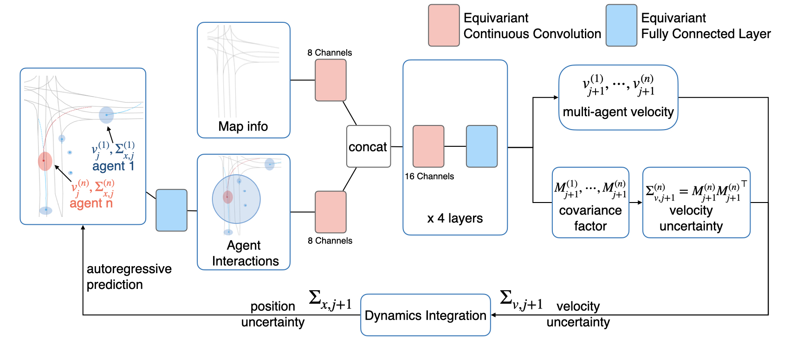

# Probabilistic Symmetry for Multi-Agent Dynamics [[Paper](https://arxiv.org/abs/2205.01927)]

**Sophia Sun, Robin Walters, Jinxi Li, Rose Yu**

To Appear in *Annual Conference on Learning for Dynamics and Control* (L4DC), 2023

*Abstract.* Learning multi-agent dynamics is a core AI problem with broad applications in robotics and autonomous driving. While most existing works focus on deterministic prediction, producing probabilistic forecasts to quantify uncertainty and assess risks is critical for downstream decision-making tasks such as motion planning and collision avoidance. Multi-agent dynamics often contains internal symmetry. By leveraging symmetry, specifically rotation equivariance, we can improve not only the prediction accuracy but also uncertainty calibration. We introduce Energy Score, a proper scoring rule, to evaluate probabilistic predictions. We propose a novel deep dynamics model, Probabilistic Equivariant Continuous COnvolution (PECCO) for probabilistic prediction of multi-agent trajectories. PECCO extends equivariant continuous convolution to model the joint velocity distribution of multiple agents. It uses dynamics integration to propagate the uncertainty from velocity to position. On both synthetic and real-world datasets, PECCO shows significant improvements in accuracy and calibration compared to non-equivariant baselines.




## Running the Code

#### Data.

Download raw datasets:
- [Argoverse Motion Forecasting 1](https://www.argoverse.org/av1.html)
- [Trajnet++ Update 4.0](https://github.com/vita-epfl/trajnetplusplusdata/releases) 

Then, proceed to preprosses datasets with the notebooks in ```PECCO/datasets```. Specific dataset APIs are required for preprocessing, please refer to their respective websites for installation guide.

#### Train model.

Install requirements.
```
pip install -r requirements.txt
```


Sample command for Argoverse: 

```
python scripts/train_pecco_argoverse.py --dataset_path ../argoverse --rho-reg --batch_size 32 --batch_divide 8 --val_batch_size 4 --use_lane --evaluation --model_name pecco_argoverse --batches_per_epoch 150 --val_batches 100 --epochs 100 --loss nll --cuda_visible_devices 0,1,2,3
```

Sample command for Pedestrian: 

```
python scripts/train_pecco_pedestrian.py --dataset_path ../pedestrian/processed --rho-reg --batch_size 24 --batch_divide 6 --val_batch_size 8 --model_name pecco_pedestrian --batches_per_epoch 180 --val_batches 25 --epochs 100 --loss nll --train --cuda_visible_devices 0,1,2,3
```